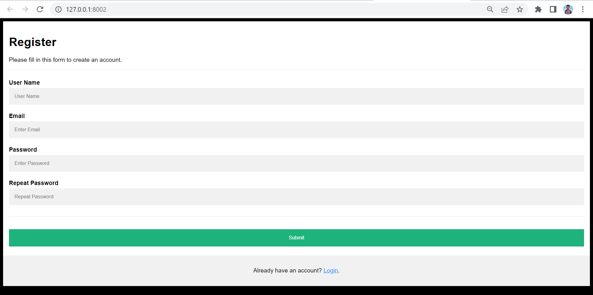

# raise-up.github.io
This is a application which women can use to live without any problems in their life.

In this project we are providing several types of Crimes on women and corresponding Supporter or Contact details are given.

It consits of Register:

Then, We need to login:

and then we will see our website:

